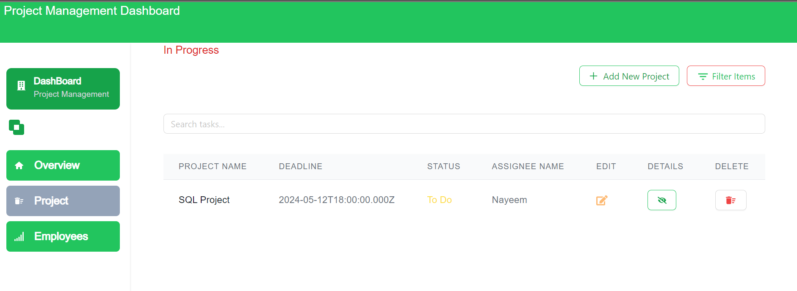

# Project Management Dashboard




## Features

### Authentication Page
- **Login Form**: Please Use this credential for Login

    email: boyneel79@gmail.com,
    password : Nnayeem12@1234

### Zustand 
- **zustand store**: First time I use it ,Really amazing

   1. https://dazzling-lolly-abb20e.netlify.app/mainPoint/6633068a2f79e468d8abde29
   when I go to this url just change status , then back to 

   https://dazzling-lolly-abb20e.netlify.app/mainPoint in this url and status will be change ,

   why I do it , try to zustand , how I get value other  state .


###  Overview Page
- **There is just Demo design.
- ** I use  Servier Side Rendering there  .

### 
- **Detailed Information**: Show detailed information about selected projects including tasks, team members, and recent activities.


### Task Filters and Search Functionality
- **Filter Tasks**: filter tasks by status, due date, or assignee.
- **Search Bar**: Provide a search bar to quickly find tasks.

### Interactive Dashboard
- **Responsive Design**:  responsive using Tailwind CSS.

## Technologies Used

- **Frontend**: Next.js 14, Ant Design, React Query, Zustand, Tailwind CSS

## Installation

1. Frontend repository:
   ```bash
     https://github.com/nayeemmehedi/project-management-frontend

     https://dazzling-lolly-abb20e.netlify.app/


1. Backend repository:
   ```bash
     https://github.com/nayeemmehedi/project-management-backend

     https://project-management-backend-rqh3.onrender.com/


    
    
